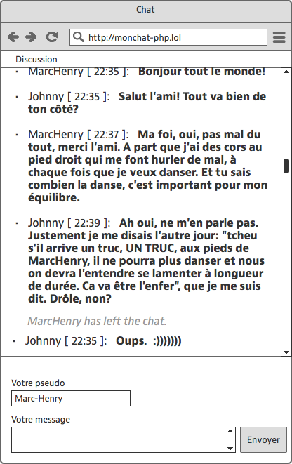

# Une application de chat, en PHP + MySQL + AJAX

Cet exercice a pour but de te remettre dans le bain après le congé et de préparer la suite de la formation: les bases de données relationnelles.

## Deadline : Lundi prochain.

## Mission

Réalisez une application permettant à plusieurs personnes de communiquer à distance, par écrit.
C'est-à-dire un chat.
Contraintes

Pour le design, chercher un layout sur le net et le faire  en **HTML + CSS et JS**

Les messages seront stockés dans une table MySQL "messages". À toi de définir les colonnes nécessaires pour réaliser l'expérience décrite dans le prototype.

## Fonctionnalités à implémenter

**"register"** : pouvoir se créer un compte utilisateur du Chat (un formulaire permettant de spécifier son email et son mot de passe). Lors de l'inscription, pas de validation par email, on est directement inscrit (pour autant que le formulaire d'inscription ait été correctement rempli.
**"login"/"logout"** : pouvoir se connecter à son compte (email + mot de passe) et se déconnecter (logout) en utilisant les sessions PHP.
**"message"** : une fois connecté, pouvoir publier des messages dans la conversation.

Si on n'est pas connecté, on peut juste lire les messages, mais pas publier. A la place du formulaire des messages, affiche une invitation à se connecter ou à s'inscrire.

Utiliser **AJAX** pour le rafraichissement du chat.

## Objectifs

1. Utiliser Git du **début** à la fin du développement.
2. Utiliser PHP et HTML
3. Utiliser une base de données MySQL
4. Voir l'authentification
5. Voir les sessions PHP
6. Rafraissement de la page en AJAX
7. Prevoir un pré-chargeur (image gif animée)
8. Remise

nom du repository : php-chat-db-ajax
**_Dans le readme.md de ton repo, indique l'url nous permettant de tester le Chat._**

## Planning

1. (Papier + bic) : Planifie et conçois ta solution en réalisant un schéma des écrans à créer... Quels fichiers ? Quelle DB ? Que doit-il se passer ? Réalise un inventaire des formulaires à créer, des fichiers. Mets de l'ordre dans ta tête.
2. Modélise la Base de données : 
3. quelle relation lie les 2 tables ? (Refais le parcours au besoin.)
4. Lis et comprends (expérimente au besoin) les sessions PHP (lmgtfy: "php session tutorial")
5. Création de son repo et dossier de travail local
6. Fonctionnalité d'inscription (**subscribe**)
7. Fonctionnalité de Connexion / Déconnexion (**login/logout**)
8. Fonctionnalité d'ajout d'un message.
9. (Objectifs secondaires)
10. Remise
